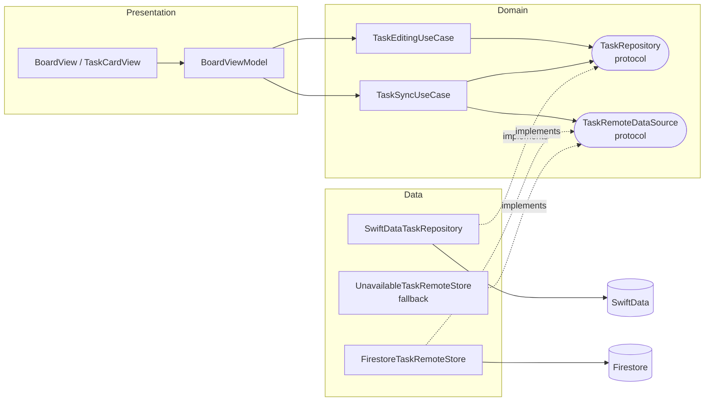

# Offline Task Board

An offline-first iOS task board — Every action (create, edit, move, reorder, delete) commits to SwiftData immediately; sync with Firestore happens through an outbox that never blocks the UI and never loses a change, online or off.

## Requirements

- Xcode 26+ (this project was built and tested on Xcode 26.6 / iOS 26.5 SDK — it's the only SDK available in the environment this was built in, so the deployment target is pinned to iOS 26.0)
- An iOS 26 simulator or device

## Architecture

MVVM + Clean Architecture, deliberately **sized to the problem** rather than maximal — a single-entity task board doesn't have enough distinct business logic per CRUD verb to justify one class per action, so the domain layer uses two cohesive use cases instead of eight thin ones. Dependencies point inward: Presentation depends on the use cases, the use cases depend only on protocols, and Data is the only layer that knows a concrete storage/network technology exists.



- **Domain** (`OfflineTaskBoard/Domain`) — `TaskItem`, `TaskStatus`, `SyncStatus` are plain Swift, no SwiftData/Firestore imports. `TaskRepository` and `TaskRemoteDataSource` are the only interfaces anything above Data depends on. `TaskEditingUseCase` covers create/update/delete/restore/move/reorder; `TaskSyncUseCase` owns the outbox, remote pulls, and conflict resolution — both fully unit-testable with in-memory fakes, no framework involved.
- **Data** (`OfflineTaskBoard/Data`) — `SwiftDataTaskRepository` is the only file that knows both `TaskItem` and SwiftData's `TaskModel` exist. `FirestoreTaskRemoteStore` implements the remote protocol against a Firestore `tasks` collection; `UnavailableTaskRemoteStore` is the fallback used whenever Firebase isn't configured, so the app never crashes or blocks on a missing remote.
- **Presentation** (`OfflineTaskBoard/Presentation`) — a single `BoardView` backed by `BoardViewModel` (`@MainActor`, `ObservableObject`). One flat, `sortOrder`-driven list rather than per-status columns — see Trade-offs below.
- **App** (`OfflineTaskBoard/App`) — `AppDependencies` is the composition root; it's the only place a concrete Data-layer type gets wired into a Domain protocol.

## Key technical decisions

- **Outbox via `SyncStatus`** (`synced` / `pendingUpload` / `pendingDelete` / `failed` / `conflicted`) on every task, plus soft-delete tombstones (`isDeleted`) so a delete can be undone before it's confirmed remotely and the remote always finds out about it. The delete path end-to-end:

  ```mermaid
  flowchart LR
      A["User taps Delete"] --> B["deleteTask()\nisDeleted = true\nsyncStatus = .pendingDelete"]
      B --> C["loadBoard() filters it out —\ncard disappears immediately"]
      C --> D["drainOutbox() finds it pending"]
      D --> E{"remote.delete() succeeds?"}
      E -- yes --> F["repository.hardDelete() —\nrow removed from SwiftData"]
      E -- no --> G["mark .failed —\nretried on next sync"]
  ```

- **Per-task failure isolation, both directions.** Each pending task's push happens in its own try/catch inside `TaskSyncUseCase`, so one task failing to sync can never block the rest of the outbox. The pull side mirrors this: `FirestoreTaskRemoteStore.fetchAll()` decodes each document independently and skips (rather than fails on) a malformed one, so one bad document from the cloud can't block every other task from being pulled.
- **Conflict policy:** each task tracks `lastSyncedUpdatedAt`, the remote timestamp as of the last confirmed sync. `sync()` pulls remote state *before* draining the outbox — pushing first would let an unconditional `setData` blindly overwrite a concurrent remote edit with no comparison at all (caught live against the real Firestore project, not just the unit tests — the earlier push-first ordering let this exact scenario through undetected). Per remote task, on pull:

  ```mermaid
  flowchart TD
      A["pullRemote: for each remote task"] --> B{"Local row exists?"}
      B -- no --> C["Insert as new, mark .synced"]
      B -- yes --> D{"Local is .pendingDelete?"}
      D -- yes --> E["Skip — a mid-delete task\nalways wins outright"]
      D -- no --> F{"Remote changed\nsince baseline?"}
      F -- no --> G["Skip — nothing to reconcile"]
      F -- yes --> H{"Local changed\nsince baseline too?"}
      H -- no --> I["Adopt remote, mark .synced"]
      H -- yes --> J["Conflict: local wins,\nmark .conflicted"]
      J --> K["drainOutbox pushes it —\nresolves within this same sync pass"]
  ```

  The sync summary tells the user when this happened ("resolved 1 conflict in your favor") rather than silently overwriting.
- **Drag-to-reorder** via SwiftUI List's native `onMove`, gated behind a compact edit-mode toggle in the header (not a full `EditButton()` text label) — swipe-to-delete and the "..." menu handle the rest, so the toggle only appears when you actually want to reorder.
- **iOS 26 Liquid Glass styling** throughout (`glassEffect`, the platform's default floating tab/toolbar treatment) since iOS 26 was the only SDK available.
- **A `RootView` gates the board behind a splash screen tied to real startup work**, not a fixed delay — it owns the single `BoardViewModel`, runs the initial `load()` + `syncNow()`, and only then reveals `BoardView`. The splash itself reuses the three status tint colors as a gradient, so the first thing shown already hints at what the app does. Status changes, the sync badge, and row insert/delete are lightly animated for the same reason — not core requirements, but the app builds toward "reorder" and other affordances more convincingly when state changes read as intentional rather than instant.
- **No force-unwrapping anywhere in the app target**, and errors shown to the user are never a raw system/framework message. `BoardViewModel` only ever surfaces its own `TaskValidationError` text verbatim (it's already written for the user, e.g. "Give the task a title before saving") — anything else, including an unexpected SwiftData failure, falls back to one honest, non-technical message ("Something went wrong saving that change. Your other tasks are safe.") rather than leaking something like a raw `NSError`/`SwiftDataError` description.

## Trade-offs

Decisions above where a real alternative was rejected, and what that cost:

- **SwiftData as source of truth over Firestore's own offline cache.** Firestore ships a built-in offline cache that would have handled a lot of this "for free." Using it would silently do the offline-first work this exercise is meant to demonstrate, so `TaskSyncUseCase` owns a custom outbox instead — more code to write and test, in exchange for actually proving the offline-first behavior rather than borrowing it from the SDK.
- **Immediate sync on every edit, not debounced or reachability-checked.** `BoardViewModel.perform()` fires a sync right after any local edit succeeds, with no coalescing window and no `NWPathMonitor` check first, and an offline attempt runs and fails rather than being skipped — traded for a simpler mental model where no individual edit's sync attempt can be silently dropped or delayed by a debounce window. `TaskSyncUseCase.sync()` does coalesce overlapping *calls* into a single in-flight pass (plus one guaranteed follow-up) rather than letting them run fully concurrently — an early version let two calls race for real, and a slow pass's fetch resolving after a faster pass had already pushed a delete could resurrect the just-deleted task locally (caught live: a deleted card would slide away, then reappear as "Synced," with Firestore never actually deleting the document — regression test: `testConcurrentSyncDoesNotResurrectATaskDeletedByAnOverlappingSync`). So the remaining cost of "not debounced" is purely redundant reads/writes on a rapid burst of edits, not a correctness risk.
- **One flat, global list instead of Kanban-style per-status columns.** A per-status column view means a status with many tasks buries the other columns off-screen. Traded per-status ordering — reorder is a single global order now (see Known limitations) — for every task staying visible at a glance regardless of how many are in one status.
- **`GoogleService-Info.plist` committed instead of gitignored.** The instinct is to keep Firebase config out of git. The trade-off is real reviewer friction (a reviewer would otherwise need their own Firebase project just to see sync work) against a real but shape-only exposure — Firestore Security Rules, not the plist, are the actual access boundary, and they were locked down and verified live against the REST API first (see Known limitations). The residual risk is bounded to "someone could write valid-looking junk to a review-only collection with no real user data," not an actual security hole.
- **CloudKit vs. Firestore.** CloudKit would have meant zero third-party dependency and zero secret file to manage — a better fit for "no undisclosed configuration" on paper. Ruled out because it needed a paid Apple Developer Program membership (not available) and, more fundamentally, because CloudKit containers are scoped to the Apple Developer Team that created them — a reviewer building this with their own Apple ID would get an empty container, not the same data, independent of the membership issue. Firestore's project credentials are shareable across unrelated builds in a way CloudKit's aren't.

## Firebase / Firestore setup

`GoogleService-Info.plist` is committed (see Trade-offs above for why), so **live sync works with zero setup** — clone, open in Xcode, build and run. `FirebaseBootstrap` detects the plist and configures Firebase automatically; `AppDependencies` picks `FirestoreTaskRemoteStore` over the offline fallback at launch.

If you want to point the app at your own Firebase project instead (e.g. to see it running against rules you control):

1. Go to the [Firebase Console](https://console.firebase.google.com), sign in, and create a project.
2. Add an iOS app with bundle ID `com.vaishnav.OfflineTaskBoard`.
3. Download the generated `GoogleService-Info.plist` and replace the one in `OfflineTaskBoard/` (Xcode: drag it in over the existing reference, "Copy items if needed" + the `OfflineTaskBoard` target checked).
4. In the console, go to **Build → Firestore Database → Create database**, and set up rules — the validation rules used here are in the "Known limitations" section below if you want to reuse them.

Deleting the plist entirely also works: the app falls back to `UnavailableTaskRemoteStore` and stays fully usable offline, with sync attempts reporting "not configured" through the same failure path as any other sync failure.

## Run and test

Open `OfflineTaskBoard.xcodeproj` in Xcode, select an iOS 26 simulator, and run. Run the test suite from the Test navigator or `xcodebuild test` — 38 tests across:

- `TaskEditingUseCaseTests` — validation, tombstoning, status changes vs. position, global reorder.
- `TaskSyncUseCaseTests` — upload/pull, per-task failure isolation, tombstone-purge-on-delete, conflict detection (both a directly-constructed conflicted state and, separately, a realistic pending-local-edit path — the latter is a regression test for a bug where the outbox draining before the pull meant a real conflict was never actually detected, only silently overwritten) and same-pass resolution.
- `SwiftDataTaskRepositoryTests` — CRUD, ordering, persistence across a fresh repository instance (relaunch equivalent), full round-trip field fidelity.
- `FirestoreTaskRemoteStoreTests` — pure mapping logic (`TaskItem` ⇄ Firestore document fields), no network or emulator involved.
- `UnavailableTaskRemoteStoreTests` — the offline fallback keeps data local and marks it `.failed` rather than losing it.

## Known limitations

- **Firestore's SPM package links into the app target but not the test target.** Firestore's binary dependencies (`abseil`, `leveldb`, `nanopb`, `gRPC-Core`/`gRPC-C++`) fail to link under the test target's separately-built `-enable-testing` variant specifically — a reproducible upstream bug on this Xcode 26 toolchain ([firebase/firebase-ios-sdk#15642](https://github.com/firebase/firebase-ios-sdk/issues/15642), [#14464](https://github.com/firebase/firebase-ios-sdk/issues/14464)), confirmed after exhausting the standard workarounds. Since XCTest unit bundles run in-process inside the host app, `FirestoreTaskRemoteStoreTests` still executes correctly against the app's already-linked symbols — this only affects how the test target itself links, not test coverage.
- **Firestore rules validate shape, not identity.** There's no authentication, so rules can restrict *what* a write looks like but not *who* is writing — someone could still write many valid-looking tasks or clear the collection. Not representative of a real deployment; acceptable for a review window with no real user data. The rules in place:

  ```
  rules_version = '2';
  service cloud.firestore {
    match /databases/{database}/documents {
      match /tasks/{taskId} {
        allow read: if true;
        allow create, update: if request.resource.data.keys().hasOnly(['title','notes','status','sortOrder','createdAt','updatedAt'])
          && request.resource.data.title is string
          && request.resource.data.title.size() > 0 && request.resource.data.title.size() < 300
          && request.resource.data.status in ['todo', 'inProgress', 'done']
          && request.resource.data.sortOrder is number;
        allow delete: if true;
      }
    }
  }
  ```

  Verified directly against the live REST API: well-formed writes return 200; a bad `status` value, an unexpected extra field, and a missing `title` were each independently confirmed to return 403. Unlike Firestore's default test-mode template, these don't have a built-in expiry — they stay in effect until changed.
- **No remote-deletion feed.** If a task were deleted directly in Firestore (bypassing the app), the app has no way to detect that and remove it locally — it would need a dedicated tombstone/deletion feed from the server, which felt like more infrastructure than this exercise needs.
- **No authentication.** All tasks live in one shared `tasks` collection — there's no per-user separation.
- **No sync while backgrounded/suspended.** Sync runs on launch, on every local edit (immediately, while the app is open — see Trade-offs above), and on manual "Sync" tap; nothing runs once the app is backgrounded. True background sync would need `BGTaskScheduler` and a background modes capability — a separate, larger piece of work than firing sync on each edit.
- **Reorder is a single global order.** There's no way to independently order tasks within a status the way per-column Kanban ordering would allow — a deliberate tradeoff for the flat-list UI (see Trade-offs above).

## Features deferred (would add with more time)

- Undo for delete (the tombstone pattern already in place makes this cheap to add — it just wasn't reached).
- A lightweight debug/dev mode for simulating offline conditions and sync failures on demand.
- A toast naming which task a sync conflict was resolved for. Right now that's only reflected in the sync bar's one-line summary ("resolved 1 conflict in your favor") — real, but easy to miss and doesn't say which task.
- A more deliberate first-launch/empty-state experience.
- Background sync via `BGTaskScheduler`.
- Retry backoff for repeatedly-failing syncs (currently a failed task just waits for the next manual sync, with no escalating delay).
- Authentication and per-user data.
- Polish on the app icon and other in-app iconography — the current icon is a quickly generated gradient-and-checkmark placeholder, not a designed mark.
- Debouncing immediate sync. Every edit fires its own sync attempt right now, so a rapid burst of edits (fast typing, quick reordering) fires that many overlapping sync passes instead of coalescing them into one — a deliberate simplicity tradeoff when immediate sync was added, but one worth revisiting.
- A reachability check (`NWPathMonitor`) before attempting a sync. An attempt made while offline today just fails harmlessly into the existing `.failed` retry path, but a reachability check would skip the pointless attempt entirely and could trigger a sync automatically the moment connectivity returns, rather than waiting for the next edit or manual tap.
- A smarter "Synced" badge: since every edit now syncs immediately while online, a task reads "Synced" almost all the time when connected, which doesn't tell the user much — the badge is genuinely useful for distinguishing pending/failed from synced while offline, less so as a constant, static label while online. Showing it only when it's informative (offline, pending, failed, or briefly right after a sync completes) rather than as a permanent per-card fixture would be a better use of that space.

## Assumptions

- A single shared task list with no authentication is acceptable for this exercise's scope.
- Committing a live Firebase config is acceptable *given* the rules genuinely restrict what can be written (verified above) — the config file itself was never the actual security boundary, so gitignoring it wouldn't have added real protection, only reviewer friction.
- iOS 26 as a minimum deployment target is acceptable, since it's the only SDK available in the build environment.
- "Reorder tasks" (an explicit core requirement) is satisfied by a single global manual ordering rather than per-status ordering, given the flat-list redesign.

## Approximate time spent

Roughly 10–12 hours across architecture and domain design, SwiftData/Firestore integration (including diagnosing the upstream Firestore linker bug above), the test suite, and several rounds of UI iteration based on feedback (Kanban columns → per-status tabs → the current flat list).

## AI tool disclosure

This project was built with Claude Code (Anthropic) as a pairing tool throughout — architecture scaffolding, implementation, debugging (including the Firestore linker investigation), test writing, and iterative UI changes were done in an AI-assisted session. Architectural direction (MVVM + Clean Architecture, SwiftData + Firestore, the flat-list UI redesign, the CloudKit-vs-Firestore call, conflict/reorder semantics) and all product decisions were made by the author through that session, with the expectation of being able to explain and defend every part of it directly.
